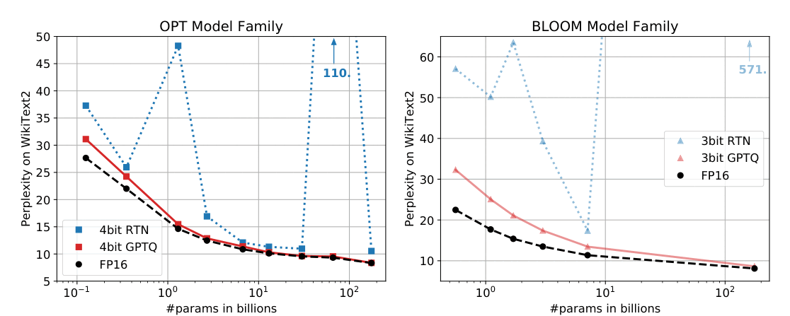
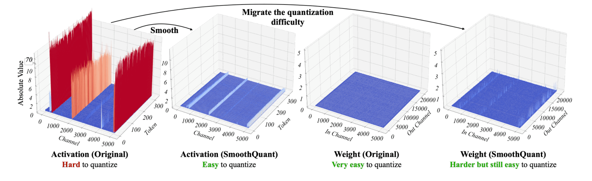
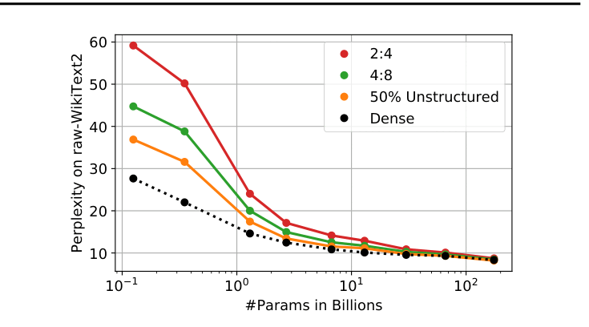
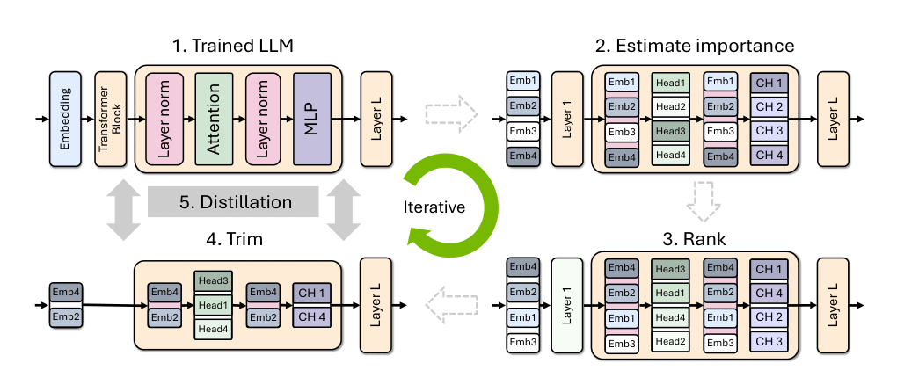
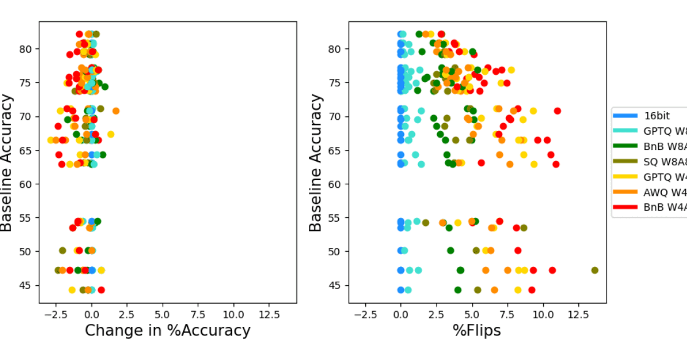
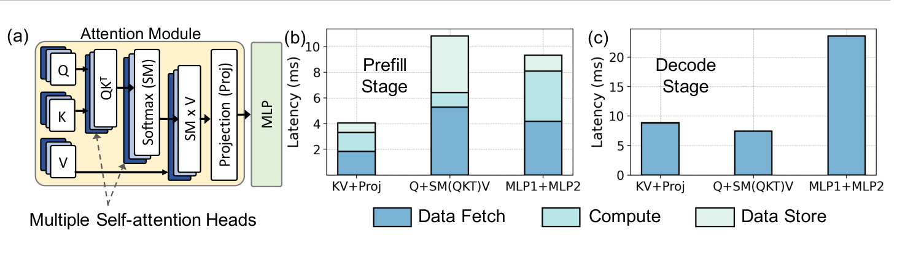

# fpga-llm-kit

Compress a pretrained language model with quantization and pruning until it fits an FPGA with
limited memory, measure what the compression costs on standard benchmarks, and prove the RTL
computes the compressed model exactly.

Under construction. The [issues](https://github.com/al-nafisah/fpga-llm-kit/issues) are the
plan, in the order their dependencies set.

## Workflow

| Step | Answers | Command |
|---|---|---|
| 1. Plan | Does the model fit the board, and how fast can it run? | `flk plan <model> --board <board>` |
| 2. Compress | Which weights, at how many bits, does the hardware keep? | `flk compress <model> -o <dir>` |
| 3. Evaluate | What did compression cost, on benchmarks others report? | `flk eval <dir>` |
| 4. Verify | Does each RTL block match the reference, bit for bit? | `uv run pytest tb` |
| 5. Run | Does a whole token come out right, and then text? | `flk generate <dir> --prompt <text>` |

Step 3 runs the integer reference, and step 4 proves the RTL computes the same bits. So a
benchmark score is the score of what the FPGA computes, not of a float model standing in for it.

Llama, Mistral, Qwen2, Qwen2.5, Qwen3 and SmolLM compute the same layer, so the model is data:
integer weights, a descriptor of its sizes, and a few tables. One RTL build runs every model that
fits within its maximum sizes. [docs/design.md](docs/design.md) has the number format, the
compression methods and why.

## Quick start

Step 1 works today. The planner reads only a model's config and tensor headers, never its
weights:

```bash
uv sync
uv run flk plan HuggingFaceTB/SmolLM2-135M --board kv260
```

```
Model   HuggingFaceTB/SmolLM2-135M: llama, 134.5 M parameters, 256.6 MiB as stored
        30 layers, width 576, FFN 1536, vocabulary 49,152
        9 query heads and 3 KV heads of 64; silu gate; lm_head shares the embedding
Board   AMD Kria KV260 (XCK26-SFVC784-2LV-C)
        4,096 MiB DDR4 at 19.2 GB/s peak, 2.9 MiB on chip, 1,248 DSPs
Build   int4 weights in groups of 32, int8 KV cache, context 2048
        32 multiply-adds per cycle at 200 MHz, DRAM at 70% of peak

Memory                         MiB
  weights                      68.9
  norms and biases             0.07
  KV cache                     22.9   2,048 tokens
  in DRAM                      91.8   of 3,072.0 free, fits
  on chip, estimated           0.02   of 2.9, fits
  longest context that fits: 8,192 tokens, the model's own limit

Per token, at token 2,048
  read from DRAM        91.8 MiB   at most 139.6 tokens/s
  multiply-adds        205.3 M     at most 31.2 tokens/s
  compute-bound: 144 multiply-adds per cycle would reach the DRAM limit (1,248 DSPs on this board)
```

A model is a Hugging Face repo id, a local folder, or a snapshot from
`flk inspect <model> --json`. Gated repos need `HF_TOKEN`. `flk boards` lists the boards; add
your own by copying a file from `src/fpga_llm_kit/boards/`.

## What the literature says

[docs/literature.md](docs/literature.md) reviews the state of the art in quantization, pruning,
evaluation and FPGA inference of language models, and draws eleven conclusions for this
project. The figures below come from papers under CC BY 4.0, cropped from the PDFs and
otherwise unchanged.

**Calibrated rounding.** Rounding each weight to the nearest 4-bit code (RTN) can wreck a model.
GPTQ corrects each column's rounding error in the columns it has not rounded yet, and stays near
fp16. With groups of 32, as here, the gap narrows but stays: Meta's int4 Llama-3.2-1B loses 6.0 MMLU points with plain
post-training quantization and 2.0 with SpinQuant and GPTQ.



<sub>Figure 1 of Frantar et al., [GPTQ](https://arxiv.org/abs/2210.17323), ICLR 2023. One scale per row, no groups.</sub>

**Activation outliers.** A few channels carry activations far larger than the rest, so int8
with one scale per vector leaves the others few levels. SmoothQuant moves that range into the
weights, and the scale folds into the RMSNorm weight before the matrix. At 4-bit weights, the
move has to protect the weights instead (AWQ), or a rotation has to spread the outliers.



<sub>Figure 4 of Xiao et al., [SmoothQuant](https://arxiv.org/abs/2211.10438), ICML 2023.</sub>

**Pruning hurts small models most.** The smallest models lose the most to one-shot pruning, and
2:4 sparsity, the pattern hardware can exploit, loses more than unstructured 50%. The models
this project targets sit at the left of this plot.



<sub>Figure 2 of Frantar and Alistarh, [SparseGPT](https://arxiv.org/abs/2301.00774), ICML 2023.</sub>

**Structured pruning needs distillation.** Removing whole heads, channels or layers leaves a
smaller dense model the descriptor can run unchanged, but recovering its accuracy takes
distillation over billions of tokens. Llama-3.2-1B was made this way from Llama 3.1.



<sub>Figure 2 of Muralidharan et al., [Compact Language Models via Pruning and Knowledge Distillation](https://arxiv.org/abs/2407.14679), NeurIPS 2024.</sub>

**Accuracy alone hides damage.** Six quantization schemes keep accuracy within 2 points of the
16-bit model on seven tasks, yet all but one change many answers, up to 13.6% of them. So each
compressed model here also reports the share of answers that flip and its KL divergence from
bf16.



<sub>Figure 1 of Dutta et al., [Accuracy is Not All You Need](https://arxiv.org/abs/2407.09141), NeurIPS 2024.</sub>

**Decode waits on DRAM.** On an edge board, fetching weights dominates the time per generated
token, so bytes per token is the number compression has to cut.



<sub>Figure 1 of Moitra et al., [MEADOW](https://arxiv.org/abs/2503.11663), MLSys 2025. DRAM at 12 Gbps.</sub>

## Layout

| Path | What |
|---|---|
| `src/fpga_llm_kit/` | Python: model import, planner, compression, bit-exact reference, evaluation |
| `src/fpga_llm_kit/boards/` | one TOML per board, every number with its source |
| `rtl/` | SystemVerilog, vendor-neutral |
| `tb/` | cocotb testbenches, one per RTL module, run under Verilator |
| `tests/` | Python unit tests; `tests/models/` holds model snapshots so they run offline |
| `docs/` | the design, the literature review and its figures |

## License

MIT. The figures in `docs/figures/` belong to their authors and are used under CC BY 4.0, as
credited above.
